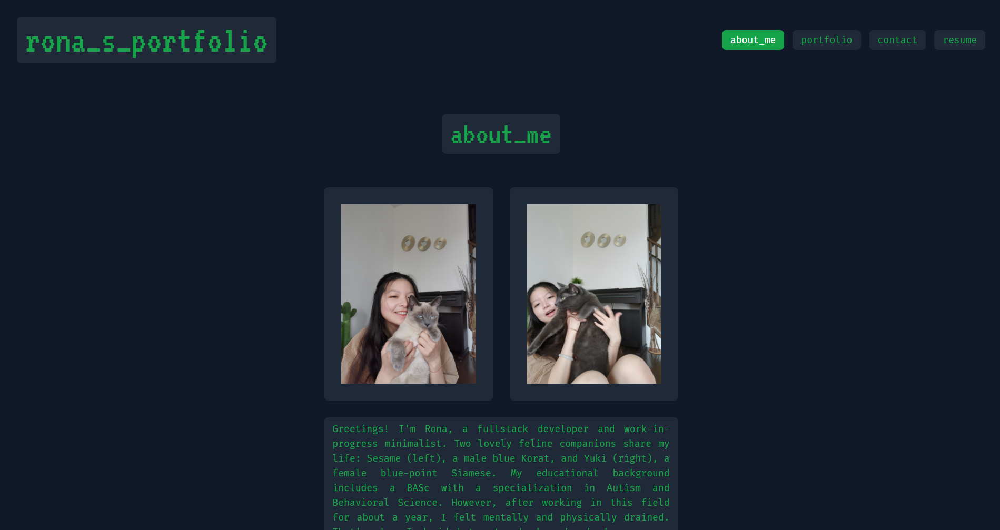
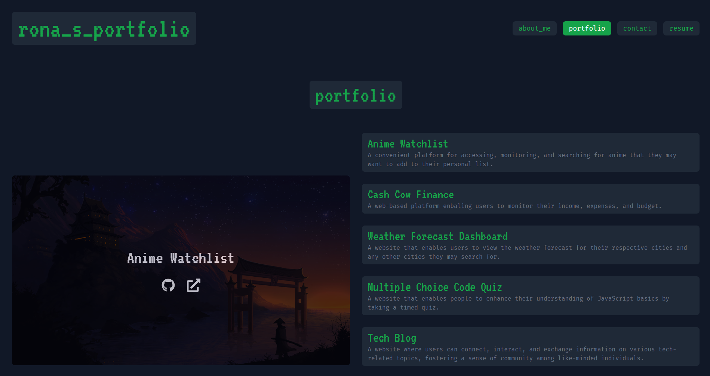

# Rona Chen's Portfolio

 

## Description

The objective of establishing this repository is to construct a personalized portfolio website that introduces oneself and showcases accomplished projects. This initiative serves as an efficacious method for potential employers to acquire a comprehensive understanding of one's competencies.

Note: Due to an insufficient number of completed projects to showcase, placeholder images have been utilized in the project section of the webpage.

 

## Table of Contents

- [Description](#description)
- [Table of Contents](#table-of-contents)
- [Demonstration](#demonstration)
- [Deployed Webpage](#deployed-webpage)
- [Technology](#technology)
- [Installation](#installation)
- [Credits](#credits)
- [License](#license)

 

## Demonstration

Application Demonstration:\
Watch it on [Google Drive](https://drive.google.com/file/d/1TRapgaW_znpTEbq26EEXu-BQnWKEBvnV/view)🖥️

Application Preview:

## Deployed Webpage

Click on the computer [🖥️](link to site) to visit the site.

 

## Technology

The application utilizes a range of technogies to delivere its functionality. These include:

- Back-End Technologies:

  - Node.js

- Front-End Technology:

  - React
  - Tailwind CSS

- Deployment:

  - GitHub

 

## Installation

No installation prerequisites are necessary.

 

## Credits

The application incorporated an external resource called Tailwind CSS to improve the visual attractiveness of the webpage and streamline its deployment. It relies on dependencies such as Node.js and GitHub Pages to achieve this.

 

## License

Please refer to the [LICENSE](https://github.com/ronachen99/portfolio/blob/main/LICENSE) document.
